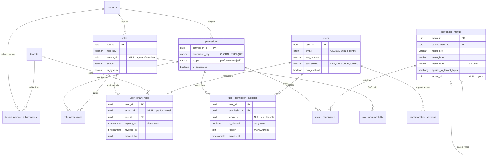
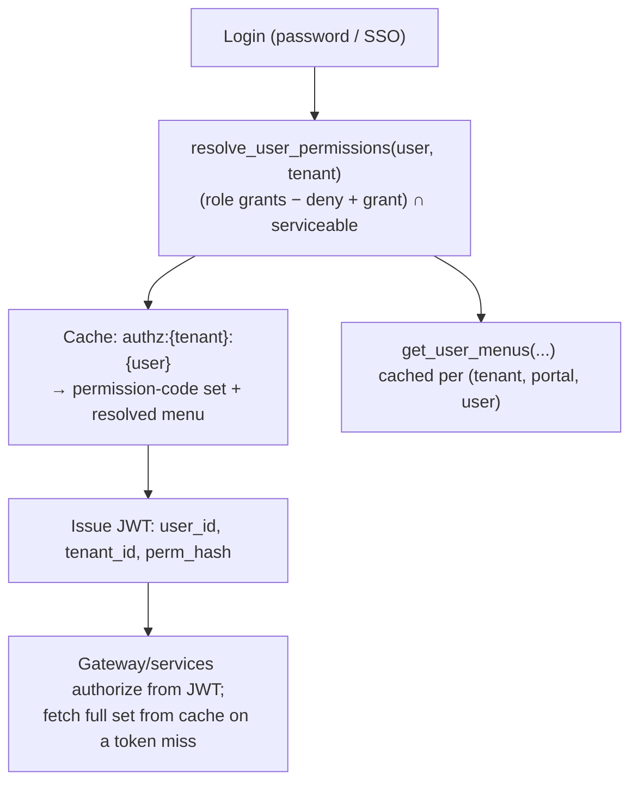

# Multi-Tenant RBAC & Dynamic Navigation — DocSlot PostgreSQL Architecture

A data-driven authorization and navigation engine for a multi-tenant healthcare PaaS. Permissions, roles, the navigation menu, and per-user exceptions **live in tables** — adding a feature, onboarding a tenant, or changing what a user can see is a *data* operation, never a deploy.

> **Status & source of truth.** This document describes the **shipped** DocSlot schema, not an aspirational design. The authoritative artifacts are the numbered SQL files in `database/`:
> - `01_platform_core.sql` — identity, permissions, roles, `role_permissions`, `user_tenant_roles`, `v_user_permissions`
> - `05_security_hardening.sql` — RLS on PHI, audit hash-chain, `purpose_of_use_log`, `access_policies`, session helpers
> - `08_rbac_navigation.sql` — `navigation_menus`, `menu_permissions`, `user_permission_overrides`, `resolve_user_permissions()`, `get_user_menus()`
> - `10_roles_grants.sql` — least-privilege `docslot_app` role
> - `11_rbac_hardening.sql` — RLS on the RBAC tables, tenant-status gate, grant-option guard, ancestor-inclusive menus, Separation of Duties, scoped impersonation
>
> If this doc and the SQL ever disagree, **the SQL wins** — update this doc to match, never the reverse.

---

## 1. Design goals

1. **Multi-tenant by construction** — one set of `platform.*` tables serves every organization; no row leaks across tenants, enforced by Row-Level Security on PHI *and* on the authorization data itself.
2. **Global identity, per-tenant authority** — one human is one `platform.users` row (global `email`), with potentially different roles in each tenant via `user_tenant_roles`. A consultant serving five hospitals is one account, not five.
3. **Product-scoped entitlement** — what a tenant has *subscribed to* (`tenant_product_subscriptions`) is separate from what a user is *authorized* to do (roles → permissions).
4. **Dynamic, permission-gated UI** — the navigation menu is data (`navigation_menus` + `menu_permissions`); each tenant-type/role/user renders a different UI from one codebase. The frontend never branches on role in JSX.
5. **Allow *and* deny, without role explosion** — broad role grants plus precise per-user `user_permission_overrides` (deny-wins, time-boxed, reason-mandatory).
6. **Resolve once, enforce everywhere** — `resolve_user_permissions()` returns the full effective set in one query; cache it, check in memory, but every protected endpoint still verifies server-side.
7. **Compliance is schema-enforced, not code-promised** — hash-chained audit, purpose-of-use logging, field encryption registry, and DPDP rights are table-backed; RBAC changes are RLS-isolated and escalation-guarded.

---

## 2. Core model

Effective access is the **intersection of two independent dimensions, minus per-user exceptions, gated by tenant health**:

```
EFFECTIVE ACCESS =
    ( ROLE GRANTS  −  DENY OVERRIDES  +  GRANT OVERRIDES )   -- USER AUTHORIZATION
  ∩  TENANT IS SERVICEABLE (active / non-expired trial)       -- ENTITLEMENT + LIFECYCLE
```

A user's role-granted permission is invisible if their tenant is suspended, cancelled, or past trial. A per-user deny beats any role grant. This separation — authority vs. tenant lifecycle vs. personal exception — is what makes DocSlot a platform rather than a single app.

| Layer | Question it answers | Tables / functions |
|---|---|---|
| **Identity** | Who is this person (across all tenants)? | `users`, `user_tenant_roles` |
| **Entitlement & lifecycle** | Is this org subscribed and in good standing? | `tenant_product_subscriptions`, `tenants.status`, `tenant_is_serviceable()` |
| **Authorization** | What can this person do here? | `permissions`, `roles`, `role_permissions`, `user_permission_overrides` |
| **Navigation** | What does this person see and reach? | `navigation_menus`, `menu_permissions` |
| **Resolution** | The above, computed once | `v_user_permissions`, `resolve_user_permissions()`, `get_user_menus()` |

### 2.1 Permission naming

Permissions are a flat, **globally unique** key registry — `<product>.<resource>.<action>`, e.g. `docslot.booking.approve`, `commission.payout.execute`, `platform.tenants.suspend`. Each carries a `scope` (`platform` / `tenant` / `self`) and an `is_dangerous` flag that drives extra UI confirmation. Optional `resource_types` / `action_types` lookups normalize the `resource`/`action` columns for admin dropdowns.

### 2.2 Entity-relationship overview



---

## 3. Schema essentials

Target: PostgreSQL 16+ (validated on 18). Uses `gen_random_uuid()`, `citext`, `pg_trgm`, RLS, recursive CTEs.

### 3.1 Identity — one user, many tenants

`platform.users` is the global identity (unique `email`, `sso_provider`/`sso_subject` with a unique partial index, MFA, lockout, `email_verified`, `must_change_password`). `platform.user_tenant_roles` is the bridge: a user holds zero-or-more roles **per tenant**; `tenant_id IS NULL` marks platform-level assignments (e.g. `super_admin`). Assignments are time-boxable (`expires_at`) and revocable (`revoked_at`, `revoked_by`, `revoked_reason`) with a `granted_by` trail.

### 3.2 Permissions & roles

`platform.permissions` is the global registry (unique `permission_key`). `platform.roles` are either **system/template** roles (`tenant_id IS NULL`, `is_system = true` — `super_admin`, `tenant_owner`, `tenant_admin`, `tenant_staff`, `tenant_viewer`, plus platform support/billing) or tenant-custom roles. `platform.role_permissions` is the role↔permission matrix, now with `is_grantable` to support the grant-option guard (§7).

### 3.3 Per-user overrides (the escape hatch)

`platform.user_permission_overrides` grants or denies a single permission to a single user, optionally within one tenant. **Deny wins.** Every override requires a `reason` and is time-boxable (`effective_from` / `expires_at`) and revocable. This is the privilege-level exception that avoids minting a bespoke role per edge case — and unlike a nav-only override, it changes the user's *actual* API authority, so menus and endpoints stay consistent.

### 3.4 Navigation tree

`platform.navigation_menus` is a self-referencing tree (`parent_menu_id`), bilingual (`menu_label` / `menu_label_hi`), tenant-type-aware (`applies_to_tenant_types[]`), product-scoped (`product_key`), with `tenant_id IS NULL` = global menu / non-null = tenant-custom. `platform.menu_permissions` maps a menu to the permission(s) that gate it (`require_all` = ANY/ALL). **A menu with no mapping is visible to all authenticated users.**

---

## 4. Tenant isolation with Row-Level Security

RLS is enforced in **two tiers**, both keyed off a transaction-local GUC the app sets per request:

```sql
-- Per request, INSIDE a transaction (transaction-local so it is pooler-safe):
BEGIN;
SELECT set_config('app.tenant_id', '<tenant-uuid>', true);   -- SET LOCAL semantics
-- ... queries ...
COMMIT;
```

**Tier 1 — PHI tables** (`05_security_hardening.sql`): `patient_medical_history`, `prescriptions`, `lab_reports`, `abdm_health_records`, `drug_alerts`. Policy: `tenant_id = current_tenant_id() OR current_is_super_admin()`.

**Tier 2 — the RBAC/entitlement tables themselves** (`11_rbac_hardening.sql`): `roles`, `role_permissions`, `user_tenant_roles`, `user_permission_overrides`, `tenant_product_subscriptions`, `navigation_menus`, `menu_permissions`. Read = own-tenant + global (`tenant_id IS NULL`) + super-admin/scoped-impersonation; write = own-tenant only, with `WITH CHECK` so a tenant cannot write rows for another tenant or inject a global (`tenant_id IS NULL`) row. **Entitlement (`tenant_product_subscriptions`) is super-admin-write-only** — a tenant cannot self-license.

The application connects as `docslot_app` — `NOSUPERUSER NOBYPASSRLS`, not the table owner — so every policy binds to it (`10_roles_grants.sql`). The resolver functions (§5) are `SECURITY DEFINER` with a pinned `search_path`, so login-time resolution still works even though direct table reads are tenant-scoped.

> `permissions`, `products`, `resource_types`, `action_types` are platform-global definitions with no `tenant_id` and intentionally no RLS. Cross-tenant platform operations use a `super_admin` session context, or — preferably for routine support — a **scoped impersonation session** (§7), not a blanket `BYPASSRLS` connection.

---

## 5. Permission & menu resolution

### 5.1 The effective-permission formula

```
effective_permissions(user, tenant) =
      role_grants(user, tenant)                 -- via user_tenant_roles → role_permissions
    − deny_overrides(user, tenant)              -- user_permission_overrides, is_allowed = false
    + grant_overrides(user, tenant)             -- user_permission_overrides, is_allowed = true
  filtered by  tenant_is_serviceable(tenant)    -- suspended/cancelled/expired-trial → ∅
```

`platform.v_user_permissions` materializes role grants (respecting `revoked_at`, `expires_at`, `is_active`, soft-deletes, and **tenant serviceability**). `platform.resolve_user_permissions(user, tenant)` applies the overrides in one query and is the basis for both API authz and the menu. `platform.user_has_permission(user, key, tenant)` is the single-permission hot path (deny-override > grant-override > role grant).

### 5.2 The menu (ancestor-inclusive)

`platform.get_user_menus(user, tenant, tenant_type, product_key)`:

1. Resolve the user's permission set **once** (`resolve_user_permissions`).
2. Select candidate menus for the product, tenant, and tenant-type.
3. Keep menus that are ungated **or** whose gating permission the user holds.
4. **Walk UP** via a recursive CTE to pull in every ancestor container, so a visible leaf under a gated parent renders inside its group rather than orphaning.
5. Return a flat, connected set; the frontend assembles the tree by `parent_menu_id`.

Menu-hiding is UX only — **every protected endpoint must still call `user_has_permission` (or check the cached set) server-side.**

---

## 6. Caching & performance

Resolve once, cache, enforce from a token; the database stays authoritative but off the hot path.



- **Cache key** `authz:{tenant_id}:{user_id}`. The menu cache key **must include the user's override fingerprint**, not just the privilege-set hash — two users with identical roles but different per-user overrides have different menus.
- **Invalidation** on any write to `role_permissions` / `user_tenant_roles` / `user_permission_overrides` / `tenant_product_subscriptions`. `LISTEN`/`NOTIFY` is a *latency optimization*; a durable mechanism (a `perm_epoch` bumped per user/tenant and compared at the edge) is the **planned correctness path** (R7, §9) so a revoked permission can't linger in a cached token.

---

## 7. Administration surface

Every RBAC mutation goes through a `SECURITY DEFINER` guard function — **never** a raw table write. R1 RLS blocks raw cross-tenant/global writes anyway, and the definer is where the escalation guard, SoD, and audit live. The .NET command handlers call these functions (passing the authenticated principal as `actor`) instead of EF inserts.

| Command | Guard function | Guardrail |
|---|---|---|
| Subscribe a tenant to a product | `INSERT tenant_product_subscriptions` | super-admin-write-only (RLS) |
| Grant a permission to a role | `grant_permission_to_role(actor, role, perm, tenant, grantable)` | super-admin **or** holds the permission *with grant option*; never confers platform scope |
| Assign a role to a user | `assign_role_to_user(actor, user, role, tenant)` | holds `tenant.roles.assign` **and** every permission the role confers (no escalation); platform roles → super-admin; SoD trigger checks incompatible pairs |
| Revoke an assignment | `revoke_role_assignment(actor, assignment, reason)` | super-admin **or** `tenant.roles.assign` in the assignment's tenant; idempotent |
| Override a user permission | `set_user_permission_override(actor, user, perm, tenant, allow, reason, …)` | `platform.overrides.grant` in-tenant; can't grant a permission the actor lacks; no platform scope; deny-wins |
| Create a custom role | `create_custom_role(actor, key, name, desc, tenant, scope)` | super-admin for platform scope, else `platform.roles.manage` / `tenant.roles.assign` in-tenant |
| Edit the menu | `INSERT/UPDATE navigation_menus` | RLS forbids writing global rows from a tenant context |
| Open support access | `begin_impersonation(actor, tenant, reason, …, ttl)` | requires `platform.users.impersonate`; one tenant, time-boxed, reason-logged, **hash-chained in `audit_log`** + break-glass alert |

A `42501` (`insufficient_privilege`) from any guard maps to a `403` at the API; an SoD `23000` maps to `409`. Because the guards are `SECURITY DEFINER` (owner-run), they satisfy R1 RLS while doing their own authorization — so a tenant admin's guarded write succeeds under RLS without any super-admin context.

**Separation of Duties** (`role_incompatibility` + `enforce_role_sod` trigger): declared role pairs (e.g. payout-approver vs payout-executor) cannot be held by the same user in the same tenant. Permission-level maker-checker (same user can't create *and* approve the same record) remains an application control.

---

## 8. Tenant onboarding (pure data)

```
1. Create tenant            → INSERT platform.tenants (status='onboarding'|'trial').
2. Subscribe to products    → INSERT tenant_product_subscriptions (super-admin path).
3. Roles                    → system/template roles already exist (tenant_id IS NULL);
                              add tenant-custom roles as needed.
4. Navigation               → inherit global menus (tenant_id IS NULL); optionally add
                              tenant-custom menu rows / gates.
5. Invite first user        → INSERT platform.users (or link SSO subject);
                              assign tenant_owner via assign_role_to_user. Owner self-manages the rest.
6. Go live                  → set tenants.status='active' (tenant_is_serviceable() now true).
```

Everything after step 1 is configuration, not deployment.

---

## 9. Roadmap (residual, not yet shipped)

These are tracked gaps beyond the current hardening:

- **R7 — Durable authz-cache invalidation.** Add a monotonic `perm_epoch` on `users`/`tenants` (bumped by triggers on the grant tables), embed it in the JWT, and reject/refresh at the edge when stale. Today invalidation leans on `NOTIFY`, which is not durable.
- **R8 — Feature-level entitlement.** Entitlement is product-level today (`tenant_product_subscriptions`) and not intersected per-feature in `get_user_menus`. If per-feature add-ons are sold, add a `tenant_feature` table and intersect it in resolution.
- **R9 — Enterprise SSO/SCIM.** `users` carries SSO subject fields, but there is no IdP-connection table or SCIM group→role provisioning/deprovisioning.
- **Platform cross-tenant reads under R1.** R1 RLS scopes RBAC-table *reads* by `docslot_app` to own-tenant + global rows. Tenant-admin consoles are unaffected; a platform operator browsing *another* tenant's roles/users needs a scoped-impersonation read context (below) or a definer read path — not a blanket super-admin GUC.
- **PHI policy wiring for scoped impersonation.** `impersonation_sessions` + `current_impersonated_tenant()` exist; the PHI policies in `05` still also honor the broader `app.is_super_admin` flag. Migrating routine support off the god-flag onto scoped sessions is a follow-up.
- **Optimistic concurrency** on admin-edited `roles` / `navigation_menus` (a version column to detect lost updates).

---

## 10. Summary

What makes DocSlot's model a platform rather than an app:

1. **Global identity + per-tenant roles** → one human, many orgs, time-boxed authority.
2. **Product entitlement + tenant lifecycle gate** → suspended/expired tenants resolve nothing, structurally.
3. **Permission-gated, tenant-type-aware, bilingual navigation tree** → every tenant/role/user renders a different UI from one codebase, ancestors always connected.
4. **Role grants + deny-wins per-user overrides** → broad access with precise, audited exceptions, no role explosion.
5. **Two-tier RLS + grant-option guard + SoD + scoped impersonation** → the authorization data is itself isolated, escalation-resistant, and support access is least-privilege.

PostgreSQL does the heavy lifting: **RLS** isolates PHI *and* RBAC data, **`SECURITY DEFINER` resolvers** keep the login path working under that RLS, **recursive CTEs** build a connected menu, **`citext`** kills identifier-casing bugs, the **hash-chained audit log** makes every change provable, and **transaction-local GUCs** stay correct behind a connection pooler. Resolve permissions once, cache them, enforce from the token — the database is the source of truth, never the bottleneck.
