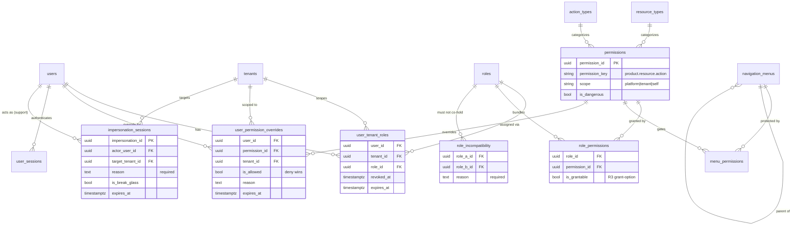
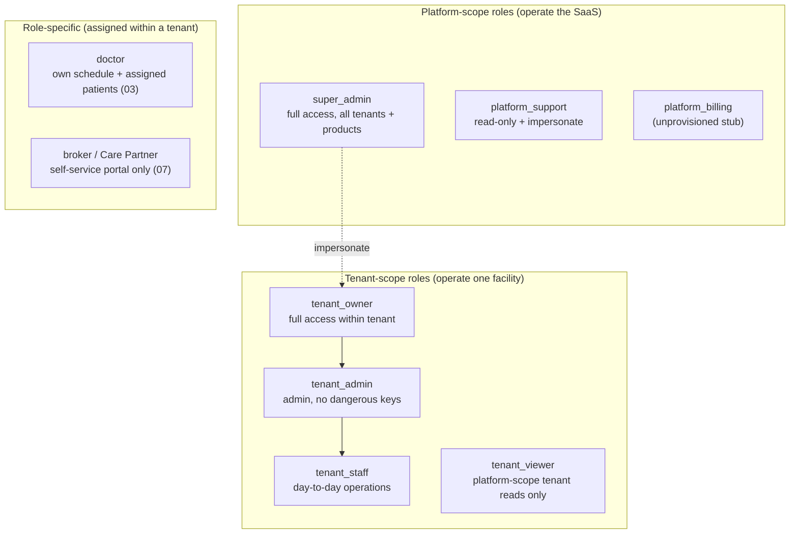
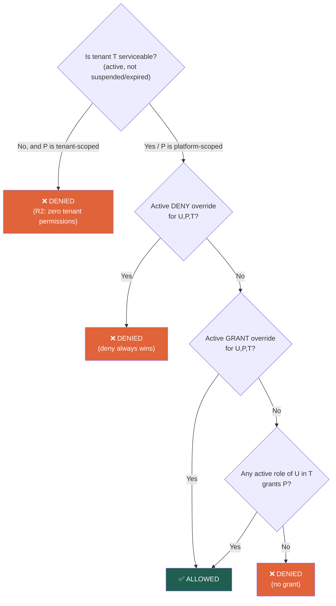
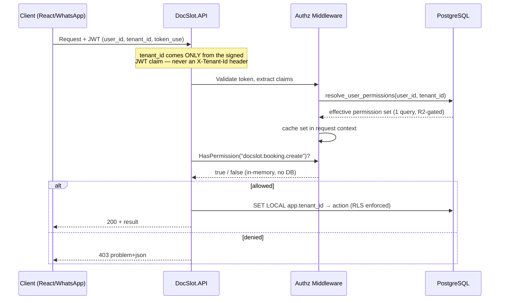
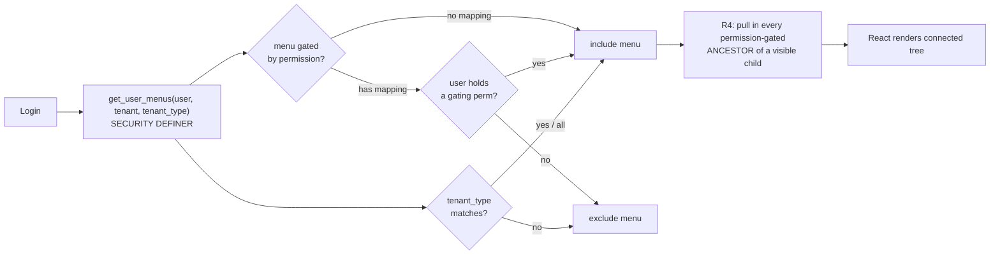
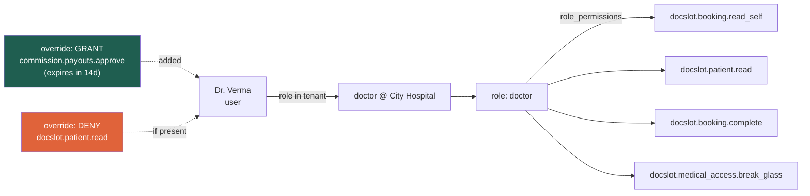

# DocSlot — Role-Based Access Control (RBAC)

| | |
|---|---|
| **Status** | Canonical — the RBAC engine as seeded and hardened across `database/01_platform_core.sql`, `03_docslot.sql`, `05_security_hardening.sql`, `07_commission_broker.sql`, `08_rbac_navigation.sql`, and — the terminal bundle file — `11_rbac_hardening.sql` (R1–R6). `04_future_products.sql` and `06_ai_services.sql` add the optional future-product and AI permission tiers. |
| **Version** | 2.0 (2026-07-01) |
| **Scope** | Whole platform (all products, all tenants) |
| **Companion** | [`RBAC_FLOW.md`](RBAC_FLOW.md) — how one live request is authorized through the .NET pipeline. **This doc owns the model + decision semantics; that doc owns the request path.** |
| **Related** | [`../RBAC_Navigation_PaaS_PostgreSQL.md`](../RBAC_Navigation_PaaS_PostgreSQL.md) (the shipped RBAC + dynamic-nav narrative), [`../.claude/skills/SECURITY.md`](../.claude/skills/SECURITY.md) (threat model + DPDP) |

This document is the single reference for how identity, roles, permissions, and access decisions work in DocSlot. **Where this doc and the SQL disagree, the SQL wins** — the PostgreSQL schema is the project's authoritative artifact. Every section below names the source file/line you can check it against.

> **What "hardened by R1–R6" means.** `11_rbac_hardening.sql` loads **last** in the bundle (after `10_roles_grants.sql`) and materially re-implements the resolvers and adds structural guards. It is *not* optional polish — it changes access decisions. The six changes:
> **R1** RLS on the RBAC/entitlement tables themselves · **R2** a tenant-serviceability gate that zeroes access for suspended/expired tenants · **R3** a privilege-escalation guard over a SECURITY DEFINER write-side API · **R4** ancestor-inclusive menus · **R5** DB-enforced Separation of Duties · **R6** scoped, time-boxed, audited impersonation. (`11_rbac_hardening.sql:1-44`.)

---

## 1. Design principles

1. **Multi-tenant first** — a user's access is always evaluated *within a tenant*. The same person can be a `doctor` in one clinic and a `tenant_owner` in another.
2. **Product-namespaced permissions** — every permission key is `product.resource.action` (e.g., `docslot.booking.create`). Products are isolated; adding a product never touches another's permissions.
3. **Deny wins** — an explicit deny override always beats a role grant. Safe default.
4. **Backend-driven** — the frontend never decides access. It renders the menu tree and permission set the backend returns.
5. **Resolve once per request** — the API computes the effective permission set a single time and checks it in memory, never a DB call per check.
6. **Least privilege + auditable** — every role is scoped; every override needs a reason; every sensitive action is logged into the hash-chained `platform.audit_log`.
7. **The serviceability gate is structural (R2)** — a suspended, cancelled, or trial-expired tenant resolves to **zero** tenant-scoped permissions and menus, regardless of what roles/overrides say. This is enforced inside the resolver, not left to app discretion (`11_rbac_hardening.sql:55`).
8. **No self-escalation (R3)** — nobody can grant authority they do not themselves hold with grant option, and only a `super_admin` can confer platform-scoped authority. Enforced by the SECURITY DEFINER management API (`grant_permission_to_role` / `assign_role_to_user` / `set_user_permission_override`, `11_rbac_hardening.sql:648-897`): direct writes to the permission **catalog** are `REVOKE`'d (`11:1731-1733`), and direct writes to the RBAC tables are RLS-gated — but RLS alone does **not** enforce the escalation guard (`11:1206-1216`), so the definer API is the only sanctioned mutation path.

---

## 2. The RBAC data model

The core RBAC model is **12 tables**; RBAC hardening RLS-protects the pre-existing `tenant_product_subscriptions` entitlement table and adds **2 more** (`impersonation_sessions` for R6, `role_incompatibility` for R5), plus the display-only `tenant_module_entitlements`. R1 puts **RLS on 7 tables** so the authorization data itself is tenant-isolated and tamper-resistant, not just the PHI tables.



| Table | Role in the model | RLS (R1)? |
|---|---|---|
| `users` | People. `is_platform_user` distinguishes staff who operate the SaaS from tenant users. | — |
| `tenants` | The isolation boundary. Every access is evaluated inside one tenant. | — |
| `roles` | Named permission bundles. `is_system` roles are global; others are tenant-custom (`tenant_id` set). `scope` = platform/tenant. | ✅ |
| `permissions` | Atomic capabilities, keyed `product.resource.action`, each with `scope` and `is_dangerous`. Catalog table — direct writes **revoked** from the app role (`11:1731`). | — (global vocab) |
| `role_permissions` | Which permissions a role grants. R3 adds **`is_grantable`** (the grant-option flag). | ✅ |
| `user_tenant_roles` | The core assignment: *this user* has *this role* in *this tenant*, optionally time-boxed (`revoked_at` / `expires_at`). SoD trigger fires here. | ✅ |
| `user_permission_overrides` | Per-user grant/deny on top of roles. Deny wins. Time-boxable. Reason required. | ✅ |
| `navigation_menus` | Backend-driven menu tree (self-referencing), tenant_type-aware, bilingual. | ✅ |
| `menu_permissions` | Which permission(s) reveal a menu item. | ✅ |
| `resource_types` | Registry of the "what" (`booking`, `patient`…). Populates admin dropdowns; `permissions.resource` VARCHAR stays the fast-path (`08:37`). | — |
| `action_types` | Registry of the "do" (`create`, `read`, `approve`…) (`08:56`). | — |
| `user_sessions` | Active authenticated sessions (JWT tracking). | — |
| `impersonation_sessions` | **R6** — scoped, time-boxed, reason-logged support impersonation. Append-only; super-only RLS (`11:316`). | ✅ (super-only) |
| `role_incompatibility` | **R5** — declares role pairs a user may not co-hold in one tenant; enforced by trigger (`11:572`). | — |
| `tenant_product_subscriptions` | Product entitlement; read-own, **write super-only** (`11:1389`). | ✅ |

> **`tenant_module_entitlements` is a display-only commercial gate, not a security boundary** (`11:1230`). It drives the "Module not licensed" greyed cell in the admin matrix. **Permission resolution never consults it** — `module_is_licensed()` is only for UI. If commercial enforcement is ever wanted, it must live explicitly at the feature entry point, never silently inside permission resolution (`11:1218-1229`).

The **7 RLS-protected tables** (R1) are exactly `roles`, `role_permissions`, `user_tenant_roles`, `user_permission_overrides`, `tenant_product_subscriptions`, `navigation_menus`, `menu_permissions` — asserted by a post-condition that fails the build if any is missing (`11:1738-1753`). Own-tenant + global rows are readable/writable via `rls_can_see_tenant()` / `rls_can_write_tenant()`; a `super_admin` context (or a live impersonation) can additionally read across tenants (`11:1194-1216`).

---

## 3. Permission model: `product.resource.action`

Every permission key has three dot-separated parts:

```
        docslot   .   booking   .   create
        └───────┘     └───────┘     └──────┘
         product      resource       action
        (namespace)  (the "what")   (the "do")
```

Plus two attributes on each permission:

- **`scope`** — how far the permission reaches:
  - `platform` — across all tenants (only for platform staff roles; a non-super actor can never *grant* one — R3)
  - `tenant` — within the user's current tenant (the common case)
  - `self` — only the user's own records (e.g., `docslot.booking.read_self`)
- **`is_dangerous`** — flags destructive/sensitive actions (`delete`, `approve`, `blacklist`, `payouts.execute`, `impersonate`, key `destroy`) for extra confirmation + audit, and excludes them from the non-dangerous auto-grant sweep given to `tenant_admin`.

### Permission inventory (~134 keys across 8 namespaces)

Counts are the seeded rows in each file (verified against the `INSERT INTO platform.permissions` blocks):

| Namespace | Seeded in | Count | Examples |
|---|---|---|---|
| `platform.*` | `01` (16) + `05` (10) + `08` (6) | **32** | `platform.tenants.{create,read,update,suspend,delete}`, `platform.users.{create,impersonate}`, `platform.roles.manage`, `platform.permissions.manage`, `platform.billing.{read,refund}`, `platform.encryption_keys.{read,rotate,destroy}`, `platform.audit.{read,verify_chain,anchor}`, `platform.anomalies.{review,respond}`, `platform.export_requests.process`, `platform.deletion.certify`, `platform.menus.{read,manage}`, `platform.overrides.{read,grant}`, `platform.{resource_types,action_types}.manage` |
| `tenant.*` | `01` (10) | **10** | `tenant.settings.{read,update}`, `tenant.users.{create,read,update,remove}`, **`tenant.roles.assign`**, `tenant.billing.read`, `tenant.audit.read`, `tenant.api_keys.manage` |
| `docslot.*` | `03` (34) + `05` (2) + `08` (2) | **38** | `docslot.booking.{create,read,read_self,approve,cancel,reschedule,complete,no_show}`, `docslot.doctor.{create,read,update,delete,update_self}`, `docslot.patient.{create,read,update}`, `docslot.prescription.{create,read,amend}`, `docslot.report.{upload,read,deliver}`, `docslot.medical_history.{read,create,update}`, `docslot.abdm.records.{read,create,link}`, `docslot.medical_access.{declare_purpose,break_glass}`, `docslot.analytics.read` |
| `commission.*` | `07` (22) | **22** | `commission.broker.{read,invite,activate,suspend,blacklist,read_self,update_self,generate_link_self,create_booking_self}`, `commission.rules.{read,create,approve}`, `commission.attribution.{read,override,claim}`, `commission.payouts.{read,approve,execute}`, `commission.tds.issue`, `commission.dispute.{raise,resolve}`, `commission.campaign.manage` |
| `ai.*` | `06` (18) | **18** | `ai.models.{read,manage}`, `ai.workflows.{read,create,activate,execute}`, `ai.runs.{read,approve}`, `ai.prompts.{read,create,medical_review,activate}`, `ai.embeddings.read`, `ai.kb.manage`, `ai.documents.{extract,review}`, `ai.predictions.read`, `ai.feedback.create` |
| `ruralreach.*` | `04` (6) | **6** | `ruralreach.vehicle.manage`, `ruralreach.request.{create,dispatch}`, `ruralreach.route.optimize`, `ruralreach.cold_chain.read` *(optional future product)* |
| `safeher.*` | `04` (4) | **4** | `safeher.female_staff.manage`, `safeher.chaperone.book`, `safeher.facility.certify`, `safeher.anonymous_bookings.read` *(optional future product)* |
| `genericfirst.*` | `04` (4) | **4** | `genericfirst.drugs.{read,manage}`, `genericfirst.suggestions.read`, `genericfirst.interactions.read` *(optional future product)* |

**Tier totals:** core (`01+03+05+07+08`) = **102** · core + AI = **120** · full bundle incl. future products = **134**.

Notes:
- **`ai` is a real product** (registered in `platform.products` by `06:515`), not just a namespace. The "RBAC management" keys (`platform.menus.*`, `platform.overrides.*`, `platform.{resource,action}_types.manage`) are **not** a separate product — they're `platform.*` keys with `product_id = NULL` seeded in `08`.
- `docslot.medical_access.{declare_purpose,break_glass}` are `docslot`-prefixed but seeded in `05` without a `product_id` (they belong to the security/consent layer, not the DocSlot product catalog).
- The correct key for assigning roles is **`tenant.roles.assign`** (`01:239`) — there is **no** `platform.roles.assign` key. (`platform.roles.manage`, for *creating custom roles*, does exist.)

---

## 4. Roles

### System roles (global, `is_system = true`)

The 7 base system roles are seeded in `01_platform_core.sql:279-286`. **`doctor` is added by `03_docslot.sql:940`** and **`broker` by `07_commission_broker.sql:944`** — `08_rbac_navigation.sql` defines **no** roles (it only adds grants for the RBAC-management keys). Tenants may also create **custom roles** (`is_system = false`, scoped to their `tenant_id`).



| Role | Scope | What it can do | Notable limits / provenance |
|---|---|---|---|
| `super_admin` | platform | Everything, every tenant, every product. Later files grant it their new keys explicitly (e.g. `07:901`). | — |
| `platform_support` | platform | The `read` action across the **01** permission set, plus `platform.users.impersonate`. | **Not** re-granted product reads (bookings/patients/commission) added by later files — its grant was frozen at 01's seed (`01:310-315`). |
| `platform_billing` | platform | Documented intent: manage billing across tenants. | **Currently inert** — seeded (`01:282`) but granted **zero** permissions in any file. Treat as an unprovisioned stub. |
| `tenant_owner` | tenant | Full control within own tenant: all `tenant`/`self`-scoped keys of every product it's entitled to, incl. user mgmt, payout **approval**, ABDM link. | Cannot cross tenant boundary; no platform-scoped keys (`payouts.execute`, `broker.blacklist`). |
| `tenant_admin` | tenant | All **non-dangerous** `tenant`/`self` keys. | No `delete`/`approve`/`blacklist`, no payout execution, no ABDM `link` (dangerous), no override grant. |
| `tenant_staff` | tenant | Bookings CRUD, patient read/update, report upload/deliver, slot/doctor read; broker read/invite, attribution read, raise disputes. | Explicit allow-list (`03:928`, `07:929`) — no rule approval, no payouts, no override. |
| `tenant_viewer` | tenant | The `tenant`-scoped **`read`** keys from **01** only: `tenant.settings.read`, `tenant.users.read`, `tenant.billing.read`, `tenant.audit.read`. | **Cannot read product data** (bookings/patients/commission) — those reads were seeded by later files and never re-granted to viewer (seeding-order artifact). |
| `doctor` | tenant | `*_self` schedule/booking, `booking.complete`, `patient.read`, full `medical_history.{read,create,update}` (03); `medical_access.{declare_purpose,break_glass}` (05); a read-mostly slice of `ai.*` (06). | `_self`-scoped where possible; the clinical writer. |
| `broker` (Care Partner) | tenant | **4** self keys: `commission.broker.{read_self,update_self,generate_link_self,create_booking_self}`. | Self-service portal only (`07:951-961`). |

### Separation of Duties is DB-enforced (R5)

Beyond the app-layer maker-checker rule (one user can't create *and* approve the **same** record), `role_incompatibility` + the `enforce_role_sod` trigger on `user_tenant_roles` **hard-block** a user from holding both roles of an incompatible pair in the same tenant — e.g. a payout-approver role and a payout-executor role (`11:564-620`). The trigger raises `integrity_constraint_violation`; NULL (platform-level) tenants compare equal so it never invents a magic UUID.

---

## 5. How an access decision is made

The order is strict — **serviceability gate → deny override → grant override → role grant**:



**Role grants are dropped** not only for expired/revoked assignments but also for **inactive (`is_active = false`) or soft-deleted users and soft-deleted roles** — the base view `v_user_permissions` filters all of these (`11:89-95`). Overrides are ignored if inactive, revoked, or past `expires_at`. One override per `(user, permission, tenant)` — grant and deny cannot coexist on the same scope.

### Read-path resolvers (never re-implemented in C#)

| Function / view | Use when | Notes |
|---|---|---|
| `platform.v_user_permissions` | Base view every resolver reads | Rolls `user_tenant_roles → roles → role_permissions → permissions`; R2-gated by `tenant_is_serviceable`; excludes inactive/deleted (`11:73`). |
| `platform.resolve_user_permissions(user, tenant)` | **Once per request** in API middleware | Full effective set (role grants − deny + grant), single query (`11:105`). |
| `platform.user_has_permission(user, key, tenant)` | One-off / DB-side guard | Single inlinable check. Not for per-request loops (`11:147`). |
| `platform.get_user_menus(user, tenant, tenant_type, product_key)` | On login / nav load | Menu tree filtered by permission AND tenant_type, ancestor-inclusive (R4). SECURITY DEFINER (`11:220`). |
| `platform.user_permissions_in_tenant(user, tenant)` | Admin/debug listing | Effective keys for one user in one tenant (`01:815`). |
| `platform.user_memberships(user)` | **Login / tenant-switch**, *before* `app.tenant_id` exists | SECURITY DEFINER cross-tenant switch-list of the caller's own tenants (`11:290`). |
| `platform.v_user_effective_permissions` | Admin "why does user X have Y?" | Shows `source = role` vs `override_grant` (`08:668`, redefined `11:185`). |

The .NET port resolves the set once via `resolve_user_permissions` and checks in memory (see [`RBAC_FLOW.md`](RBAC_FLOW.md)) — it never re-derives precedence in C#.

### Write-path: the management API (R3-guarded, SECURITY DEFINER)

Because R1 puts RLS on the RBAC tables and R3 revokes direct catalog writes, **all mutation flows through these SECURITY DEFINER functions**, each of which asserts the actor is entitled to what they're doing (`11:629-1124`):

| Function | Guard |
|---|---|
| `grant_permission_to_role(actor, role, perm, tenant, grantable)` | Actor must be `super_admin`, **or** hold the permission itself **with grant option** (`is_grantable`) and it must not be platform-scoped. |
| `revoke_permission_from_role(...)` | Same escalation guard, in reverse. |
| `assign_role_to_user(actor, user, role, tenant)` | Actor may only confer authority they may confer; SoD trigger still fires. |
| `revoke_role_assignment(...)` | Blocked by the **last-active-admin guard** (see §4/§10) when it would strand a tenant with no admin. |
| `set_user_permission_override(...)` | Reason required; same no-escalation rule. |
| `create_custom_role(...)` / `duplicate_role(...)` | Tenant-scoped role authoring. |
| `create_permission(...)` / `create_resource_type(...)` | Catalog authoring — the **only** way in, since direct `INSERT/UPDATE` on `permissions`/`resource_types`/`action_types` is revoked from `docslot_app` (`11:1731-1733`). |
| `is_super_admin(user)` | Helper — universal-grantor test. |

---

## 6. Request lifecycle (end to end)

Two independent walls protect data — **RBAC** decides *can this action run*; **RLS** decides *which rows are even visible*. RBAC failing returns 403; RLS simply returns zero rows. The full .NET pipeline (gateway → middleware → handler → UnitOfWork) is documented in [`RBAC_FLOW.md`](RBAC_FLOW.md); the load-bearing invariants are:



- **Tenant is derived only from the signed JWT (IDOR guardrail).** The active `tenant_id` is read from the token claim, never from a client-supplied header; it feeds both RLS (`SET LOCAL app.tenant_id`) and `resolve_user_permissions`. Switching tenant **re-mints** a token via `POST /api/v1/auth/switch-tenant` after a server-side membership check (`mediq.Api/Context/RequestContext.cs:36-46`, `AuthController.cs:42`).
- **RLS now covers the RBAC tables too (R1).** Sensitive PHI tables use the predicate `current_tenant_id() OR current_impersonated_tenant()` (`05:685-714`); the RBAC/entitlement tables use `rls_can_see_tenant` / `rls_can_write_tenant`, which additionally admit a `super_admin` context (`11:1194-1216`, `1344-1425`). Because the resolver and membership functions are SECURITY DEFINER, login-time cross-tenant reads still work despite RLS.
- **Client-credentials tokens are a separate scheme.** `token_use=user` goes through permission resolution + `[RequirePermission]`. `token_use=client` **bypasses** permission resolution entirely and is gated by `[RequireScope]` → `scope:<key>` against live-token validation. `token_use=service` is the AI PHI wall (default-deny on authenticated endpoints). See `RequireScope.cs`, `ScopeResolutionMiddleware.cs`, and [`RBAC_FLOW.md §3`](RBAC_FLOW.md).

---

## 7. Backend-driven navigation

Menus live in the database and are filtered per user. The frontend renders the returned tree — no hardcoded show/hide.



**R4 — ancestor inclusion.** `get_user_menus` was rewritten as a RECURSIVE, SECURITY DEFINER walk-up: a visible child under a gated parent no longer orphans — the container is pulled in so the tree stays connected (`11:211-282`, superseding the flat `08:298` version).

Same `tenant_owner`, different tenant types → different menus. The figures below are **top-level sections**; the full flat tree a `tenant_owner` receives is larger (≈23 / 22 / 21 nodes for hospital / lab / individual-doctor once children are included):

| tenant_type | Top-level sections |
|---|---|
| `hospital` | 14 (full set incl. Doctors + Lab Tests) |
| `pathology_lab` | 13 (no Doctors menu) |
| `individual_doctor` | 12 (no Doctors, no Lab Tests) |

Add a feature = insert menu rows + map a permission → it appears for the right users on next login. No frontend deploy.

---

## 8. Per-user overrides — the escape hatch

Use overrides for exceptional cases instead of minting near-duplicate roles.

| Scenario | Override |
|---|---|
| Dr. Sharma (doctor) must approve payouts during owner's leave | GRANT `commission.payouts.approve`, `expires_at` = leave end |
| Receptionist misused cancel; keep the rest of the role | DENY `docslot.booking.cancel` |
| Temporary auditor needs read-only broker data for a month | GRANT `commission.attribution.read`, 30-day expiry |

Rules: reason mandatory, time-boxable, fully audited. Admin "why does user X have Y?" is answered by `platform.v_user_effective_permissions` (`source = role | override_grant`). The `user_permission_overrides` table is RLS-protected (R1), and overrides are written through `set_user_permission_override`, which applies the R3 no-escalation rule. **Use sparingly** — heavy override use is a signal your role design needs refinement.

---

## 9. Worked example: Dr. Verma at City Hospital



- Base: the doctor role grants `read_self` bookings, `patient.read`, `booking.complete`, and (from `05`) `medical_access.{declare_purpose,break_glass}`.
- A **grant override** temporarily adds payout approval (auto-expires).
- If a **deny override** on `docslot.patient.read` existed, Dr. Verma would lose patient read *even though the role grants it* — deny wins.
- **`break_glass` is a permission to *request* emergency access, not the access itself.** Holding `docslot.medical_access.break_glass` lets Dr. Verma open a **break-glass grant** (§12) when a patient has no active consent; the consent-gated read still refuses until that scoped, time-boxed grant exists.

---

## 10. Extending RBAC safely

Since R1/R3, RBAC changes go **through the management API**, not raw INSERTs (direct writes are revoked/RLS-gated):

- **New permission** → `platform.create_permission(...)` (and `create_resource_type` / register the action). Map it to roles via `platform.grant_permission_to_role(actor, role, perm, tenant, grantable)`, which enforces the no-escalation / grant-option / no-platform-scope-by-non-super rules. Gate a menu via `menu_permissions`.
- **New role** → `platform.create_custom_role(...)` or `duplicate_role(...)`; bundle permissions via `grant_permission_to_role`. Never grant a `self`-scoped permission where `tenant` is needed, or vice-versa.
- **Assigning roles** → `platform.assign_role_to_user(...)`; the **SoD trigger** (R5) blocks incompatible pairs, and the **last-active-admin guard** blocks revokes/deactivations that would leave a tenant with no admin (`tenant_has_other_active_admin`, keyed on `tenant.users.update`/`tenant.roles.assign` — permission-based, not role-name-based; `11:1448`).
- **New menu** → insert into `navigation_menus` (set `applies_to_tenant_types` + `product_key`), map gating permission via `menu_permissions`. Surfaces automatically, ancestor-inclusive.

### User lifecycle

Tenant-scoped user management runs through SECURITY DEFINER functions, **never** a raw flip of global `users.is_active`: `set_tenant_user_active` (deactivate = revoke this tenant's memberships with a reserved `[deactivated]` marker; reactivate = restore exactly those, re-running the escalation guard), `update_user_profile`, and `reset_user_access` (`11:1478,1588,1636`). Deactivating or revoking a tenant's **last** admin is blocked (→ 409) by `tenant_has_other_active_admin`.

**Guardrails**: **never write the RBAC tables directly** — RLS permits own-tenant / super_admin writes but does *not* enforce the R3 escalation guard (`11:1206-1216`), so the SECURITY DEFINER API above is the only sanctioned mutation path. `security-compliance-auditor` reviews every new permission for scope + danger flag; new tenant tables must carry `tenant_id` and an RLS evaluation; payout **execution** stays a distinct (platform-scoped) permission from payout **approval**.

---

## 11. Support impersonation (R6)

Routine support access is a **scoped, time-boxed, audited impersonation session** — replacing the blunt all-or-nothing `app.is_super_admin` GUC that would bypass PHI RLS across every tenant.

- **Permission:** `platform.users.impersonate` (`is_dangerous`, platform-scope; `01:220`). Held by `super_admin` and `platform_support`.
- **Lifecycle:** `platform.begin_impersonation(actor, target_tenant, reason, target_user?, ttl?, break_glass?)` requires the permission and a **non-empty reason**, inserts an `impersonation_sessions` row, and hash-chains an `impersonate` entry into `audit_log` in the same transaction. `platform.end_impersonation(id, actor)` writes the audited **close** half (idempotent; the opener may self-close, anyone else needs the permission) (`11:399-528`).
- **Time-boxed:** `expires_at` is mandatory (CHECK `expires_at > started_at`); the SQL default TTL is 30 min, and the `.NET` endpoint **validates** `TtlMinutes` to **1–480 (8h)**, rejecting out-of-range values with a 400 (`ImpersonationCommands.cs:30`).
- **Audited by construction:** the raw `app.impersonated_tenant` GUC is **inert on its own** — `current_impersonated_tenant()` resolves it to a tenant **only** while a live, non-expired session exists for the acting user, and such rows can only be created by `begin_impersonation` (which audits). Setting the GUC without a session unlocks nothing and emits no audit (`11:382-396`).
- **Break-glass impersonation** (`is_break_glass = true`) additionally raises a `critical` row in `platform.alerts` (code `impersonation.break_glass`) for review (`11:441-447`).
- **Endpoints:** `POST /api/v1/auth/impersonation/{begin,end}` (re-mints a token scoped to the target); `GET /api/v1/security/impersonation-sessions` lists them for review (`AuthController.cs:54,66`; `SecurityController.cs:69`).

`impersonation_sessions` is append-only (only `ended_at`/`ended_by_user_id` may change) and RLS-confined to a `super_admin` context — a tenant can neither read nor forge one (`11:336-363`).

---

## 12. Break-glass emergency access

Break-glass is DPDP **Layer-2** emergency authorization (`FR-MED-03`): a deliberate, scoped, time-boxed override that lets the consent-gated clinical **read** handlers proceed when a patient has no active consent. `platform.purpose_of_use_log` records *that* a break-glass happened (the review queue); `platform.break_glass_grants` is the authorization that *produces* it (`05:731-777`).

- **Scope (least privilege):** `resource_type ∈ {prescription, lab_report, medical_history}` + optional `resource_id` (NULL = patient-wide for that class; a specific-resource grant does **not** unlock a patient-wide list).
- **Mandatory short TTL** (`expires_at`, set server-side); expired/revoked grants never unlock. Grants can be revoked.
- **ABDM is deliberately excluded** — the `CHECK` constraint forbids an `abdm_record` grant from even being created; ABDM stays gated by the separate NHA two-gate consent regime.
- **Tenant-confined:** `tenant_id` leads the active-grant index and an RLS policy — a grant in tenant A can never unlock a read in tenant B.
- **Review queue:** every use surfaces on `platform.v_security_review_queue` via `purpose_of_use_log.is_break_glass` (`05:938-962`).
- **Endpoints:** `POST /api/v1/security/break-glass` (gated on `docslot.medical_access.break_glass`) opens a grant; `POST /api/v1/security/break-glass/{grantId}/revoke` (gated on `platform.anomalies.review`) revokes it (`SecurityController.cs:116-128`).

---

## 13. Quick reference

```
Assignment:   user ──(user_tenant_roles)── role ──(role_permissions)── permission
Override:      user ──(user_permission_overrides: is_allowed)── permission   [deny wins]
Decision:      serviceable-tenant (R2) → deny-override > grant-override > role-grant
Key format:    product.resource.action   (scope: platform|tenant|self)   [~134 keys / 8 namespaces]
Resolve:       resolve_user_permissions()  ← once per request, check in memory
Menus:         get_user_menus()            ← backend-driven, tenant_type-aware, ancestor-inclusive (R4)
Manage:        grant_permission_to_role() / assign_role_to_user() / create_permission()  ← SECURITY DEFINER, R3-guarded
Audit "why":   v_user_effective_permissions (source = role | override_grant)
Impersonate:   begin_impersonation() → scoped, time-boxed, audited (R6)
Break-glass:   break_glass_grants → scoped, TTL'd override of the clinical consent gate
Hardening:     R1 RLS-on-RBAC · R2 serviceability · R3 no-escalation · R4 menu ancestors · R5 SoD · R6 impersonation
```

> Companion: [`RBAC_FLOW.md`](RBAC_FLOW.md) traces how a single live request is authorized through the .NET pipeline (gateway → middleware → `[RequirePermission]`/`[RequireScope]` → RLS-scoped UnitOfWork). This doc is the model; that one is the request path.
