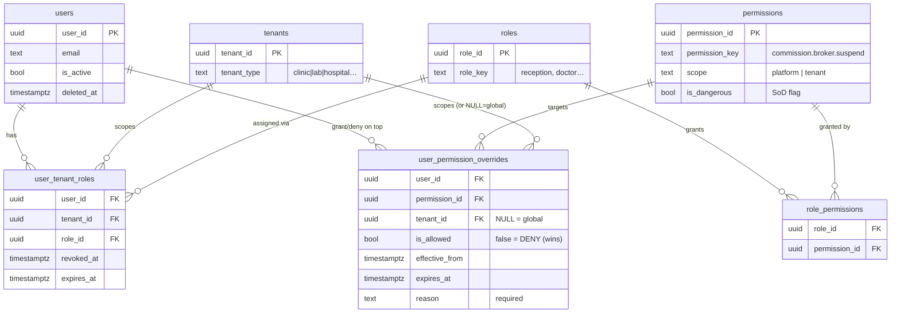
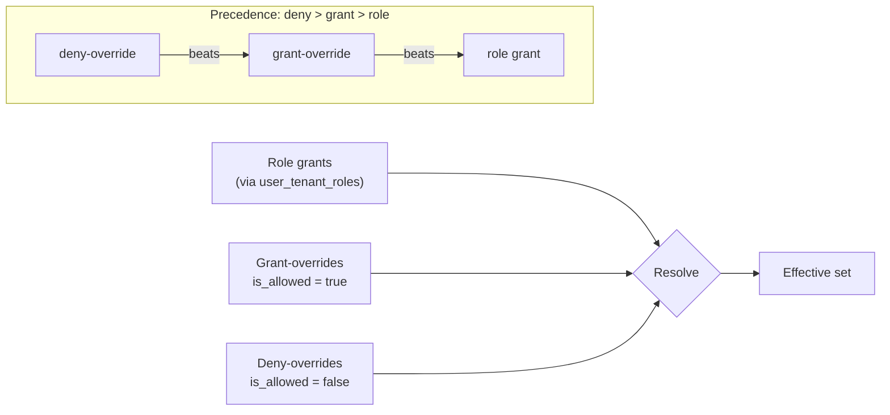
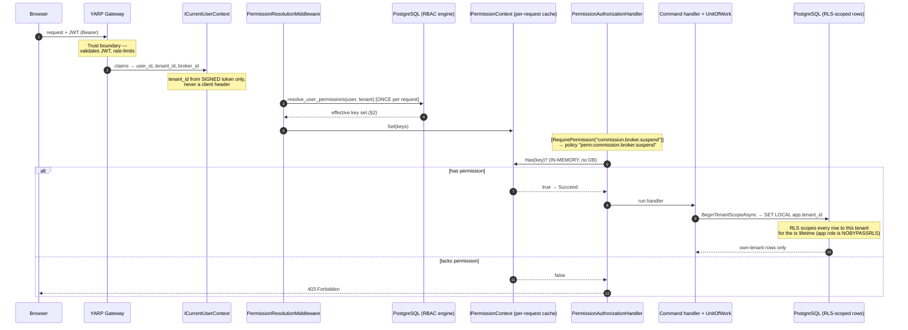
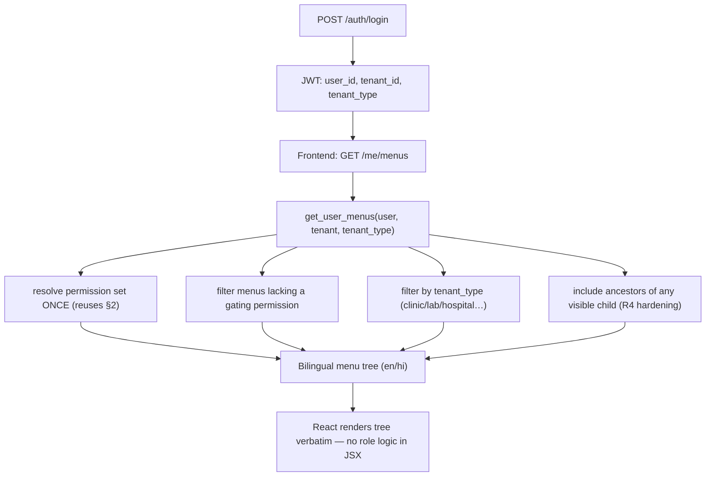

# RBAC Flow — How Authorization Works in DocSlot

> How a request gets authorized in DocSlot, traced from the PostgreSQL RBAC engine up
> through the .NET authorization pipeline to the backend-driven frontend navigation.
>
> **The schema owns the resolution logic** (deny-wins, time-boxed overrides,
> tenant-type-aware menus). The .NET side never reimplements it — it calls
> `platform.resolve_user_permissions()` once per request and checks the result in memory.
>
> Source of truth: [`database/08_rbac_navigation.sql`](../database/08_rbac_navigation.sql) +
> [`database/11_rbac_hardening.sql`](../database/11_rbac_hardening.sql).
>
> **Companion:** [`RBAC.md`](RBAC.md) owns the canonical model — the tables, the ~134-key
> permission inventory, the roles, the decision semantics, and the R1–R6 hardening. **That
> doc is the model; this one is the request path.**

---

## 1. Data model — where permissions live

Access is `user → (tenant, role) → permissions`, with a per-user override layer on top.
**No code ever checks a role name** — only *permission keys*.



The view `platform.v_user_permissions`
([`01_platform_core.sql:755`](../database/01_platform_core.sql)) rolls
`user_tenant_roles → roles → role_permissions → permissions` into an effective
per-user/per-tenant grant list, excluding revoked/expired role assignments and inactive users.

---

## 2. Effective-permission resolution — the precedence rule

`platform.resolve_user_permissions(user, tenant)`
([`08_rbac_navigation.sql:251`](../database/08_rbac_navigation.sql), hardened in
[`11_rbac_hardening.sql:105`](../database/11_rbac_hardening.sql)) computes the entire set
in **one query**:

```
    role grants (v_user_permissions, this tenant + platform-scope)
  −  deny-overrides        ← DENY ALWAYS WINS
  +  grant-overrides       (a deny+grant on the same key can't coexist: UNIQUE)
  ─────────────────────────────────────────
  =  effective permission set
```



Expired, revoked, or wrong-tenant overrides are ignored. Overrides are **time-boxable**
(`effective_from` / `expires_at`) and **every override requires a reason**. This is the
single source of truth — the .NET port
([`RbacAbstractions.cs`](../backend/mediq/mediq.Application/Abstractions/RbacAbstractions.cs))
never re-derives it in C#.

---

## 3. Request-time flow — how one API call gets authorized

Two walls stack, defense-in-depth: **RBAC** decides *can this user do this action*; **RLS**
decides *which rows they can touch*.



Key files in this path:

| Step | File |
|---|---|
| Principal + tenant from JWT | [`CoreAbstractions.cs:15`](../backend/mediq/mediq.Application/Abstractions/CoreAbstractions.cs) (`ICurrentUserContext`) |
| Resolve once per request | [`PermissionResolutionMiddleware.cs:28`](../backend/mediq/mediq.Api/Authorization/PermissionResolutionMiddleware.cs) |
| Per-request cache | [`CoreAbstractions.cs:94`](../backend/mediq/mediq.Application/Abstractions/CoreAbstractions.cs) (`IPermissionContext`) |
| Declarative gate + in-memory check | [`RequirePermission.cs:31`](../backend/mediq/mediq.Api/Authorization/RequirePermission.cs) |
| RLS tenant scope per tx | [`UnitOfWork.cs:67`](../backend/mediq/mediq.Infrastructure/Persistence/UnitOfWork.cs) (`SET LOCAL app.tenant_id`) |

> **Client-credentials tokens** (`token_use=client`) skip permission resolution entirely and
> go through a parallel **scope** policy (`[RequireScope]` → `scope:<key>`,
> [`RequireScope.cs`](../backend/mediq/mediq.Api/Authorization/RequireScope.cs)). They carry
> scopes, not user permissions.

---

## 4. Backend-driven navigation

The frontend never branches on role in JSX — it renders whatever the menu tree returns.



`platform.get_user_menus()`
([`08_rbac_navigation.sql:298`](../database/08_rbac_navigation.sql), hardened in
[`11_rbac_hardening.sql:220`](../database/11_rbac_hardening.sql)) resolves the permission set
once, then joins menus against it — no per-menu function calls.

---

## 5. Invariants this enforces

| Invariant | Where |
|---|---|
| No hardcoded role checks — permission keys only | `RequirePermission.cs`, `v_user_permissions` |
| Deny-wins, time-boxed per-user overrides (reason required) | `resolve_user_permissions` ([`08_rbac:251`](../database/08_rbac_navigation.sql)) |
| Resolve once per request, check in memory (NFR-PERF-01) | `PermissionResolutionMiddleware` + `IPermissionContext` |
| `tenant_id` from the signed JWT only, never a header | [`CoreAbstractions.cs:22`](../backend/mediq/mediq.Application/Abstractions/CoreAbstractions.cs) |
| Separation of Duties via distinct dangerous keys (`broker.suspend` ≠ `broker.activate`; payout `approve` ≠ `execute`) | `is_dangerous` permissions; `CommissionController` split |
| RLS is the second wall — app role is `NOBYPASSRLS`, `SET LOCAL app.tenant_id` per tx | [`UnitOfWork.cs:67`](../backend/mediq/mediq.Infrastructure/Persistence/UnitOfWork.cs) |
| Menus backend-driven, permission + tenant_type filtered | `get_user_menus` |
| RBAC tables themselves are RLS-protected + escalation-guarded (R1–R6) | [`11_rbac_hardening.sql`](../database/11_rbac_hardening.sql) |
